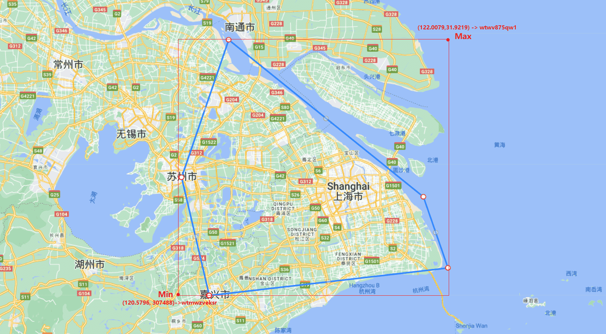
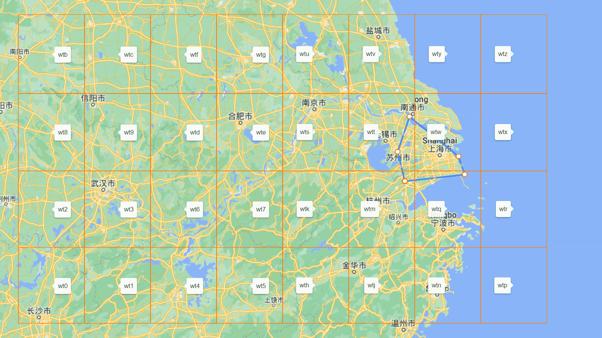
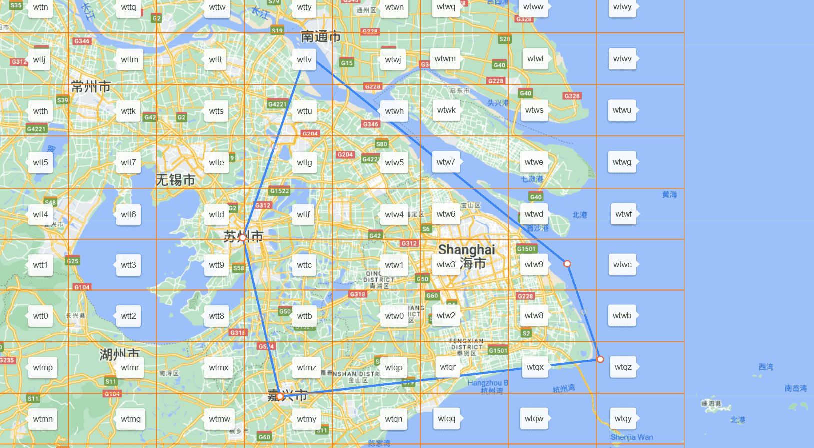
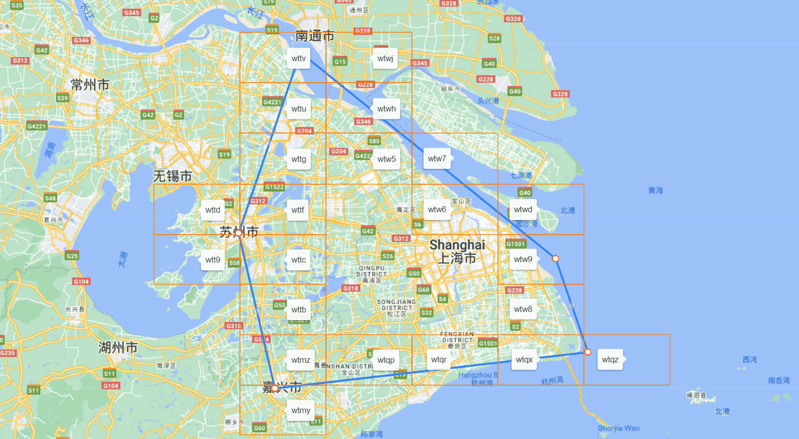

## Function Introduction
This tool provides the ability to determine the administrative region based on latitude and longitude. It includes the following main features:

1) By using fractal algorithms to grid a specified geographical fence, it returns a collection of geohashes and data compression algorithms.
2) Provides high-precision fences for global administrative regions. Based on Feature 1, it generates geohash fences and provides a method to determine the administrative region based on latitude and longitude with low time and space complexity.
3) Currently provides gridded data sources for provincial, municipal, and district boundaries in China, as well as global country boundaries.

# Core Class Introduction
## generator
### Region2GeoHashUtil
This class provides an algorithm to grid a specified geographical fence and return a GeoHash string.
#### Brief Algorithm Description
+ Convert the geoJson file into a string format of "lng lat,lng lat,...." to form a closed interval, such as:
  ```
  120.7296 30.7488,122.0079 30.8752,121.8756 31.2030,120.8326 31.9219,120.5796 31.2926,120.7296 30.7488,120.7296 30.7488
  ```
  
+ First, find the maximum and minimum longitude and latitude of this fence. The ten-digit geohashes are wtwv875qw1 and wtmwzveksr, and the two geohashes share the same prefix "wt". Therefore, this fence must be inside the geohash rectangle "wt".
  
  Determine the relationship between the 32 three-digit geohash rectangles within "wt" and the fence. There are no geohash rectangles inside the fence, but there are geohash rectangles that intersect with the fence: wtm, wtq, wtt, and wtw.
  
  Determine the relationship between the four-digit geohash rectangles within wtm, wtq, wtt, and wtw, which intersect with the fence.
  
  At this point, the geohash rectangles inside the fence are: wtw0, wtw1, wtw2, wtw3, and wtw4.
  
  The geohash rectangles that intersect with the fence are: wtmy, wtmz, wtqp, wtqr, wtxq, wtqz, wtt9, wttb, wttc, wttd, wttf, wttg, wttu, wttv, wtw5, wtw6, wtw7, wtw8, wtw9, wtwd, wtwh, wtwj.
  
  Further determine the relationship between the more detailed geohash rectangles within the intersecting rectangles obtained in the previous step and the fence.
  At this point, the geohash rectangles inside the fence are:
  ```
  wtw0,wtw1,wtw2,wtw3,wtw4,wtmz7,wtmze,wtmzg,wtmzh,wtmzj,wtmzk,wtmzm,wtmzq,wtmzr,wtmzs,wtmzt,wtmzu,wtmzv,wtmzw,wtmzx,wtmzy,wtmzz,wtqp2,wtqp3,wtqp6,wtqp7,wtqp8,wtqp9,wtqpb,wtqpc,wtqpd,wtqpe,wtqpf,wtqpg,wtqpk,wtqpm,wtqpq,wtqpr,wtqps,wtqpt,wtqpu,wtqpv,wtqpw,wtqpx,wtqpy,wtqpz,wtqr8,wtqr9,wtqrb,wtqrc,wtqrd,wtqre,wtqrf,wtqrg,wtqrs,wtqrt,wtqru,wtqrv,wtqrw,wtqrx,wtqry,wtqrz,wtqx8,wtqx9,wtqxb,wtqxc,wtqxf,wtqxg,wtqxu,wtqxv,wtqxy,wttb5,wttb6,wttb7,wttbd,wttbe,wttbf,wttbg,wttbh,wttbj,wttbk,wttbm,wttbn,wttbp,wttbq,wttbr,wttbs,wttbt,wttbu,wttbv,wttbw,wttbx,wttby,wttbz,wttc1,wttc3,wttc4,wttc5,wttc6,wttc7,wttc9,wttcc,wttcd,wttce,wttcf,wttcg,wttch,wttcj,wttck,wttcm,wttcn,wttcp,wttcq,wttcr,wttcs,wttct,wttcu,wttcv,wttcw,wttcx,wttcy,wttcz,wttf1,wttf3,wttf4,wttf5,wttf6,wttf7,wttfd,wttfe,wttff,wttfg,wttfh,wttfj,wttfk,wttfm,wttfn,wttfp,wttfq,wttfr,wttfs,wttft,wttfu,wttfv,wttfw,wttfx,wttfy,wttfz,wttg4,wttg5,wttg7,wttge,wttgh,wttgj,wttgk,wttgm,wttgn,wttgp,wttgq,wttgr,wttgs,wttgt,wttgu,wttgv,wttgw,wttgx,wttgy,wttgz,wttuh,wttuj,wttuk,wttum,wttun,wttup,wttuq,wttur,wttut,wttuv,wttuw,wttux,wttuy,wttuz,wttvn,wtw50,wtw51,wtw52,wtw53,wtw54,wtw55,wtw56,wtw57,wtw58,wtw59,wtw5b,wtw5c,wtw5d,wtw5e,wtw5f,wtw5g,wtw5h,wtw5j,wtw5k,wtw5m,wtw5n,wtw5p,wtw5q,wtw5r,wtw5s,wtw5t,wtw5u,wtw5v,wtw5w,wtw5x,wtw60,wtw61,wtw62,wtw63,wtw64,wtw65,wtw66,wtw67,wtw68,wtw69,wtw6b,wtw6c,wtw6d,wtw6e,wtw6f,wtw6g,wtw6h,wtw6j,wtw6k,wtw6m,wtw6n,wtw6p,wtw6q,wtw6s,wtw6t,wtw70,wtw71,wtw72,wtw74,wtw80,wtw81,wtw82,wtw83,wtw84,wtw85,wtw86,wtw87,wtw88,wtw89,wtw8b,wtw8c,wtw8d,wtw8e,wtw8f,wtw8g,wtw8h,wtw8j,wtw8k,wtw8m,wtw8n,wtw8s,wtw8t,wtw8u,wtw8v,wtw90,wtw91,wtw92,wtw93,wtw94,wtw95,wtw96,wtw97,wtw98,wtw99,wtw9d,wtw9h,wtw9k,wtwd0,wtwh0,wtwh1,wtwh2,wtwh3,wtwh4,wtwh5,wtwh6,wtwh8,wtwh9,wtwhb,wtwhh
  ```
  
+ The geohash rectangle intersecting the fence has
  ```
  wtmyg,wtmyu,wtmyv,wtmyy,wtmz4,wtmz5,wtmz6,wtmzd,wtmzf,wtmzn,wtmzp,wtqp0,wtqp1,wtqp4,wtqp5,wtqph,wtqpj,wtqpn,wtqpp,wtqr0,wtqr2,wtqr3,wtqr6,wtqr7,wtqrk,wtqrm,wtqrq,wtqrr,wtqx2,wtqx3,wtqx6,wtqxd,wtqxe,wtqxs,wtqxt,wtqxw,wtqxx,wtqxz,wtqz8,wtqzb,wtt9z,wttb1,wttb3,wttb4,wttb9,wttbb,wttbc,wttc0,wttc2,wttc8,wttcb,wttdp,wttf0,wttf2,wttf8,wttf9,wttfc,wttg1,wttg3,wttg6,wttgd,wttgf,wttgg,wttu5,wttu7,wttue,wttus,wttuu,wttvh,wttvj,wttvm,wttvp,wttvq,wttvr,wttvt,wttvw,wtw5y,wtw5z,wtw6r,wtw6u,wtw6v,wtw6w,wtw6x,wtw6y,wtw73,wtw75,wtw76,wtw77,wtw78,wtw79,wtw7b,wtw7h,wtw8p,wtw8q,wtw8r,wtw8w,wtw8y,wtw9b,wtw9c,wtw9e,wtw9f,wtw9g,wtw9j,wtw9m,wtw9n,wtw9s,wtw9t,wtwd1,wtwd2,wtwd3,wtwd4,wtwh7,wtwhc,wtwhd,wtwhe,wtwhf,wtwhj,wtwhk,wtwhm,wtwhn,wtwj0,wtwj1
  ```
  
+ Repeat the more precise geohash that intersects with the fence until it meets the required accuracy for the scene
  
+ According to the accuracy of administrative regions, the minimum geohash is generally accurate to 7-8 bits to meet the requirements
  

## lookup (The following logical descriptions have time to improve)
### GeoTilesSearch
Provide relevant methods for quickly finding the region to which longitude and latitude belong
### GlobalMapHelper
Determine which country the longitude and latitude are based on Geo Hash (WGS84 coordinates)
### GlobalMapHelper
Determine whether latitude and longitude are in China based on Geo Hash (WGS84 coordinates)
### GeoHashHelper
Encapsulated a method for converting longitude and latitude to geohash


