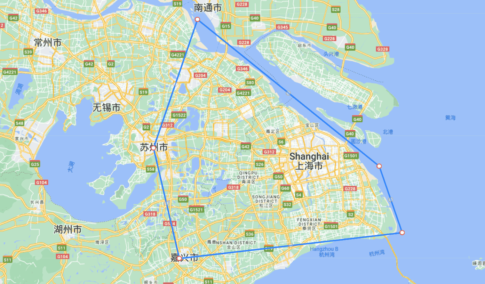
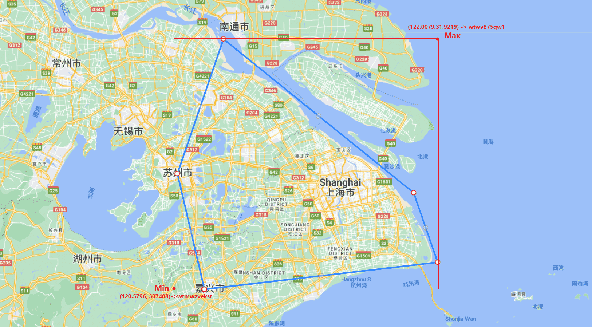
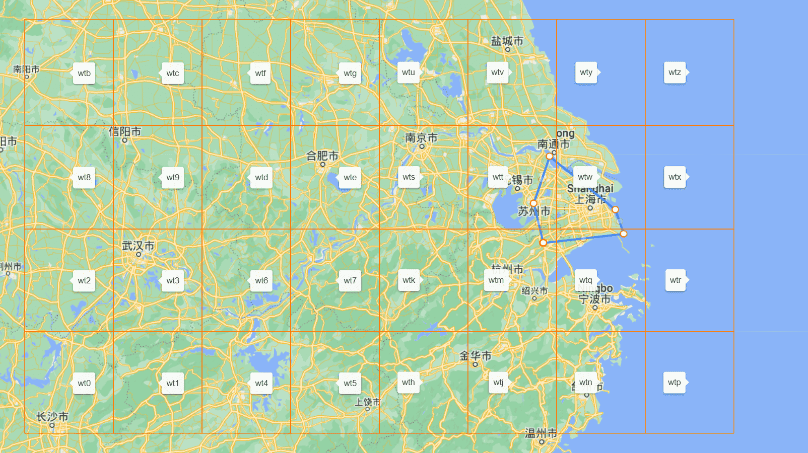
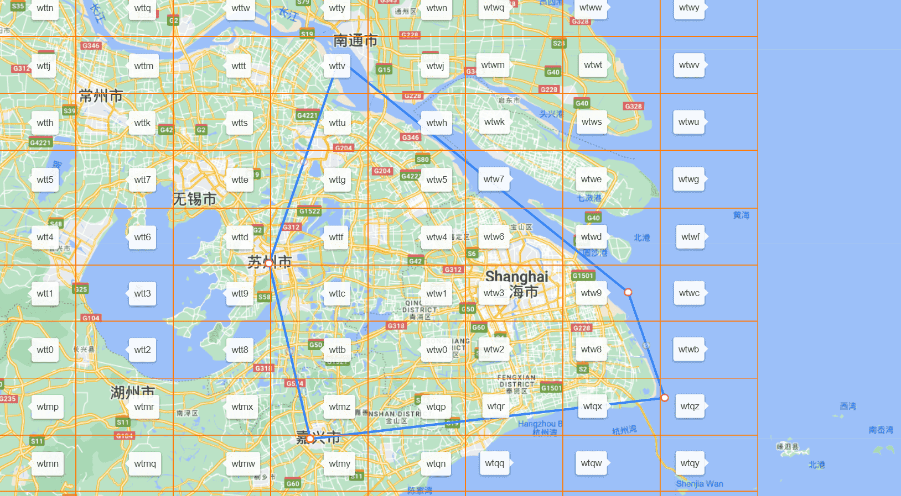
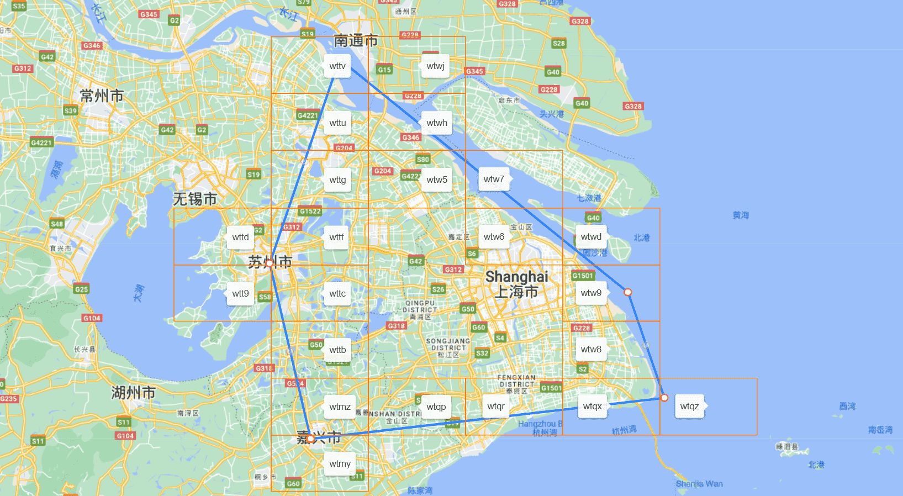
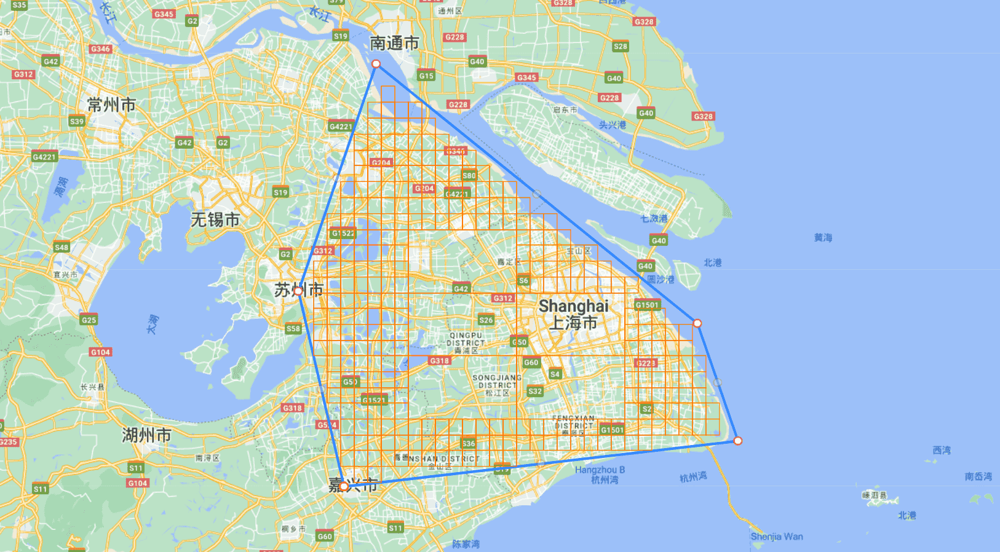
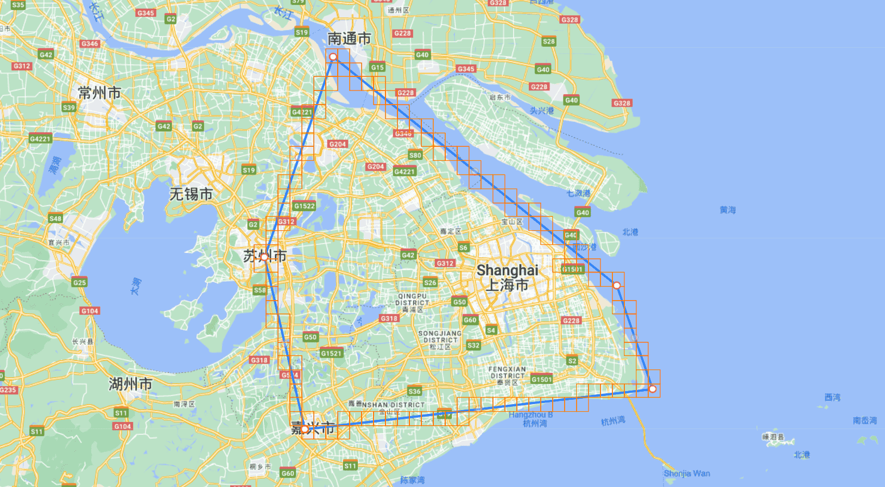
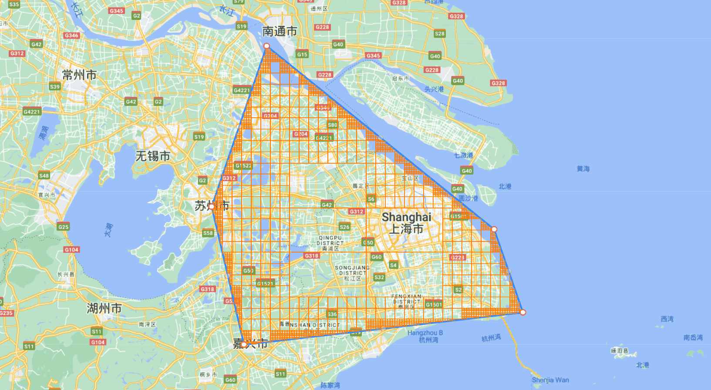
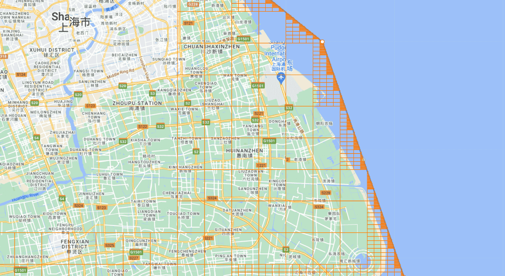

## 功能介绍
该工具提供了根据经纬度判断所属的行政区域，主要包括：

1) 通过边界分形的手段将指定的地理围栏栅格化，返回geohash集合,及数据压缩算法。
2) 提供全球行政区域的高精度围栏,根据功能1生成geohash栅栏格,并提供低时间复杂度与低空间复杂度的根据经纬度判断所属行政区域的方法
3) 目前提供中国省市区边界及全球国家边界的栅格化数据源

## 核心类介绍
### Region2GeoHashUtil
该类提供算法，将指定的地理围栏栅格化，并返回GeoHash字符串
#### 算法简要说明
+ 将geoJson文件转为格式为"lng lat,lng lat,...."的字符串,形成一个封闭区间,如:
  ```
  120.7296 30.7488,122.0079 30.8752,121.8756 31.2030,120.8326 31.9219,120.5796 31.2926,120.7296 30.7488,120.7296 30.7488
  ```
  
+ 首先找到此围栏的最大经纬度与最小经纬度,十位geohash分别为wtwv875qw1,wtmwzveksr,两点geohash有相同wt,因此此围栏一定在geohash矩形wt内
  
+ 将wt内32个三位geohash矩形与围栏的位置关系做判断,在围栏内的geohash矩形:无,与围栏相交的geohash矩形有wtm,wtq,wtt,wtw
  
+ 将上一步求出的与围栏相交的矩形wtm,wtq,wtt,wtw内四位geohash矩形与围栏位置做判断
  
+ 此时在围栏内的geohash矩形:wtw0,wtw1,wtw2,wtw3,wtw4
  
+ 与围栏相交的geohash矩形有wtmy,wtmz,wtqp,wtqr,wtqx,wtqz,wtt9,wttb,wttc,wttd,wttf,wttg,wttu,wttv,wtw5,wtw6,wtw7,wtw8,wtw9,wtwd,wtwh,wtwj
  
+ 进一步将上一步求出的与围栏相交的矩形内更精细的geohash矩形与围栏位置做判断
+ 此时在围栏内的geohash矩形:
  ```
  wtw0,wtw1,wtw2,wtw3,wtw4,wtmz7,wtmze,wtmzg,wtmzh,wtmzj,wtmzk,wtmzm,wtmzq,wtmzr,wtmzs,wtmzt,wtmzu,wtmzv,wtmzw,wtmzx,wtmzy,wtmzz,wtqp2,wtqp3,wtqp6,wtqp7,wtqp8,wtqp9,wtqpb,wtqpc,wtqpd,wtqpe,wtqpf,wtqpg,wtqpk,wtqpm,wtqpq,wtqpr,wtqps,wtqpt,wtqpu,wtqpv,wtqpw,wtqpx,wtqpy,wtqpz,wtqr8,wtqr9,wtqrb,wtqrc,wtqrd,wtqre,wtqrf,wtqrg,wtqrs,wtqrt,wtqru,wtqrv,wtqrw,wtqrx,wtqry,wtqrz,wtqx8,wtqx9,wtqxb,wtqxc,wtqxf,wtqxg,wtqxu,wtqxv,wtqxy,wttb5,wttb6,wttb7,wttbd,wttbe,wttbf,wttbg,wttbh,wttbj,wttbk,wttbm,wttbn,wttbp,wttbq,wttbr,wttbs,wttbt,wttbu,wttbv,wttbw,wttbx,wttby,wttbz,wttc1,wttc3,wttc4,wttc5,wttc6,wttc7,wttc9,wttcc,wttcd,wttce,wttcf,wttcg,wttch,wttcj,wttck,wttcm,wttcn,wttcp,wttcq,wttcr,wttcs,wttct,wttcu,wttcv,wttcw,wttcx,wttcy,wttcz,wttf1,wttf3,wttf4,wttf5,wttf6,wttf7,wttfd,wttfe,wttff,wttfg,wttfh,wttfj,wttfk,wttfm,wttfn,wttfp,wttfq,wttfr,wttfs,wttft,wttfu,wttfv,wttfw,wttfx,wttfy,wttfz,wttg4,wttg5,wttg7,wttge,wttgh,wttgj,wttgk,wttgm,wttgn,wttgp,wttgq,wttgr,wttgs,wttgt,wttgu,wttgv,wttgw,wttgx,wttgy,wttgz,wttuh,wttuj,wttuk,wttum,wttun,wttup,wttuq,wttur,wttut,wttuv,wttuw,wttux,wttuy,wttuz,wttvn,wtw50,wtw51,wtw52,wtw53,wtw54,wtw55,wtw56,wtw57,wtw58,wtw59,wtw5b,wtw5c,wtw5d,wtw5e,wtw5f,wtw5g,wtw5h,wtw5j,wtw5k,wtw5m,wtw5n,wtw5p,wtw5q,wtw5r,wtw5s,wtw5t,wtw5u,wtw5v,wtw5w,wtw5x,wtw60,wtw61,wtw62,wtw63,wtw64,wtw65,wtw66,wtw67,wtw68,wtw69,wtw6b,wtw6c,wtw6d,wtw6e,wtw6f,wtw6g,wtw6h,wtw6j,wtw6k,wtw6m,wtw6n,wtw6p,wtw6q,wtw6s,wtw6t,wtw70,wtw71,wtw72,wtw74,wtw80,wtw81,wtw82,wtw83,wtw84,wtw85,wtw86,wtw87,wtw88,wtw89,wtw8b,wtw8c,wtw8d,wtw8e,wtw8f,wtw8g,wtw8h,wtw8j,wtw8k,wtw8m,wtw8n,wtw8s,wtw8t,wtw8u,wtw8v,wtw90,wtw91,wtw92,wtw93,wtw94,wtw95,wtw96,wtw97,wtw98,wtw99,wtw9d,wtw9h,wtw9k,wtwd0,wtwh0,wtwh1,wtwh2,wtwh3,wtwh4,wtwh5,wtwh6,wtwh8,wtwh9,wtwhb,wtwhh
  ```
  
+ 与围栏相交的geohash矩形有
  ```
  wtmyg,wtmyu,wtmyv,wtmyy,wtmz4,wtmz5,wtmz6,wtmzd,wtmzf,wtmzn,wtmzp,wtqp0,wtqp1,wtqp4,wtqp5,wtqph,wtqpj,wtqpn,wtqpp,wtqr0,wtqr2,wtqr3,wtqr6,wtqr7,wtqrk,wtqrm,wtqrq,wtqrr,wtqx2,wtqx3,wtqx6,wtqxd,wtqxe,wtqxs,wtqxt,wtqxw,wtqxx,wtqxz,wtqz8,wtqzb,wtt9z,wttb1,wttb3,wttb4,wttb9,wttbb,wttbc,wttc0,wttc2,wttc8,wttcb,wttdp,wttf0,wttf2,wttf8,wttf9,wttfc,wttg1,wttg3,wttg6,wttgd,wttgf,wttgg,wttu5,wttu7,wttue,wttus,wttuu,wttvh,wttvj,wttvm,wttvp,wttvq,wttvr,wttvt,wttvw,wtw5y,wtw5z,wtw6r,wtw6u,wtw6v,wtw6w,wtw6x,wtw6y,wtw73,wtw75,wtw76,wtw77,wtw78,wtw79,wtw7b,wtw7h,wtw8p,wtw8q,wtw8r,wtw8w,wtw8y,wtw9b,wtw9c,wtw9e,wtw9f,wtw9g,wtw9j,wtw9m,wtw9n,wtw9s,wtw9t,wtwd1,wtwd2,wtwd3,wtwd4,wtwh7,wtwhc,wtwhd,wtwhe,wtwhf,wtwhj,wtwhk,wtwhm,wtwhn,wtwj0,wtwj1
  ```
  
+ 重复判断与围栏相交的更精细的geohash,直至满足场景所需精度
  
+ 按照行政区域的精度来说,一般最小geohash精确至7~8位即可满足需求
  

